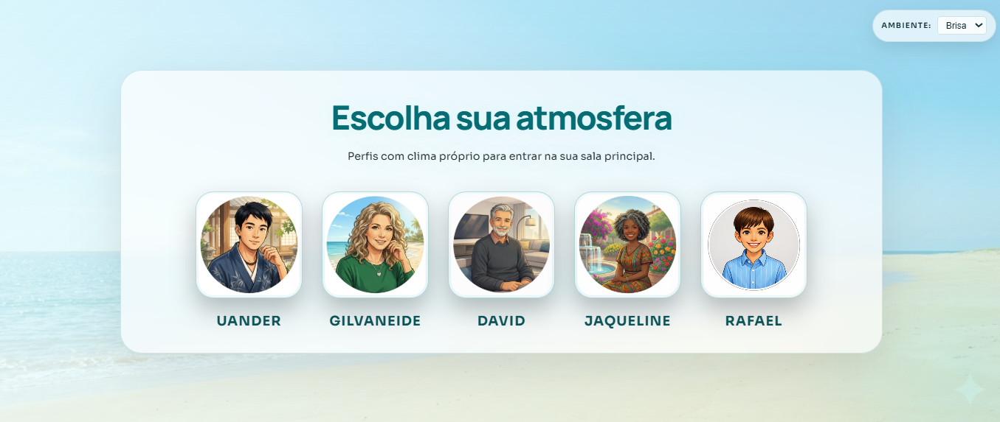

<h1 align="center">MareVista</h1>

<p align="center">
   Interface front-end de streaming com foco em identidade visual, perfis personalizados e navegação dinâmica.
</p>

<p align="center">
   
   
   
   
   
</p>

<p align="center">
   
</p>

<p align="center">
   
</p>

## Links Rápidos

- 🔗 Deploy: https://gilvaneidemedeiros.github.io/MareVista/
- 💻 Repositório: https://github.com/GilvaneideMedeiros/MareVista
- 🎓 Contexto de prática: Imersão Front-end da Alura

## Preview

<p align="center">
   
</p>

## Visão Geral

A MareVista é uma experiência fictícia de streaming criada para demonstrar design visual, personalização por perfil e navegação dinâmica, inspirada em produtos reais, mas com identidade própria.

O projeto foi construído com HTML, CSS e JavaScript, com foco em portfólio e evolução prática de front-end.

## Sumário

- [Destaques](#destaques)
- [Tecnologias](#tecnologias)
- [Identidade e Design](#identidade-e-design)
- [Estrutura do Projeto](#estrutura-do-projeto)
- [Como Executar Localmente](#como-executar-localmente)
- [Fluxo da Aplicação](#fluxo-da-aplicação)
- [Deploy](#deploy)
- [Observações](#observações)
- [Autora](#autora)

## Destaques

- Seleção de perfis com navegação fluida para o catálogo.
- Persistência de perfil ativo com nome e avatar via localStorage.
- Catálogo dinâmico com carrosséis renderizados por JavaScript.
- Seções personalizadas por usuário para uma experiência individual.
- Tema por perfil salvo separadamente (modo Noite e modo Brisa).
- Proteção de rota para evitar acesso direto ao catálogo sem perfil selecionado.
- Publicação contínua no GitHub Pages com GitHub Actions.

## Tecnologias

- HTML5
- CSS3
- JavaScript (ES Modules)
- GitHub Pages
- GitHub Actions

## Stack Visual

| Camada | Tecnologias |
|---|---|
| Estrutura | HTML5 |
| Estilo | CSS3 |
| Comportamento | JavaScript (ES Modules) |
| Publicação | GitHub Pages |
| CI/CD | GitHub Actions |

## Identidade e Design

- Marca fictícia própria: MareVista.
- Paleta principal em azul-tifany e preto.
- Splash screen exclusiva e microinterações revisadas.
- Interface reformulada para reduzir semelhanças visuais com referências externas.

## Estrutura do Projeto

```text
.
├── index.html
├── script.js
├── style.css
├── assets/
├── catalogo/
│   ├── catalogo.html
│   ├── catalogo.css
│   └── js/
│       ├── data.js
│       ├── main.js
│       ├── utils.js
│       └── components/
│           ├── Card.js
│           └── Carousel.js
└── .github/
    └── workflows/
        └── deploy-pages.yml
```

## Como Executar Localmente

Como é um projeto estático, você pode abrir o arquivo index.html no navegador.

Para melhor experiência com módulos ES no catálogo, use um servidor local:

- VS Code + Live Server, ou
- terminal com servidor simples (exemplo):

```bash
npx serve .
```

Depois, acesse a URL informada no terminal.

## Fluxo da Aplicação

1. A aplicação inicia na tela de perfis.
2. Ao clicar em um perfil:
   - nome e imagem são salvos no localStorage;
   - o usuário é redirecionado para o catálogo.
3. O catálogo lê o perfil ativo e atualiza:
   - nome no topo;
   - avatar no topo;
   - títulos de seção por perfil;
   - preferência de tema por perfil.

## Deploy

O deploy está configurado no arquivo .github/workflows/deploy-pages.yml.

A publicação ocorre automaticamente a cada push na branch main.

### Configuração no GitHub

- Repositório > Settings > Pages
- Source: GitHub Actions

## Observações

- Alguns cards usam thumbnails de fontes externas, cuja disponibilidade pode variar ao longo do tempo.
- Se alterações não aparecerem no navegador, faça um hard reload com Ctrl + F5.

## Autora

Gilvaneide Medeiros
